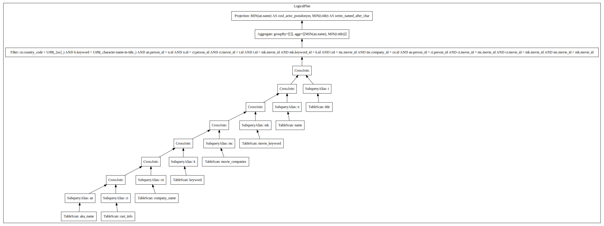
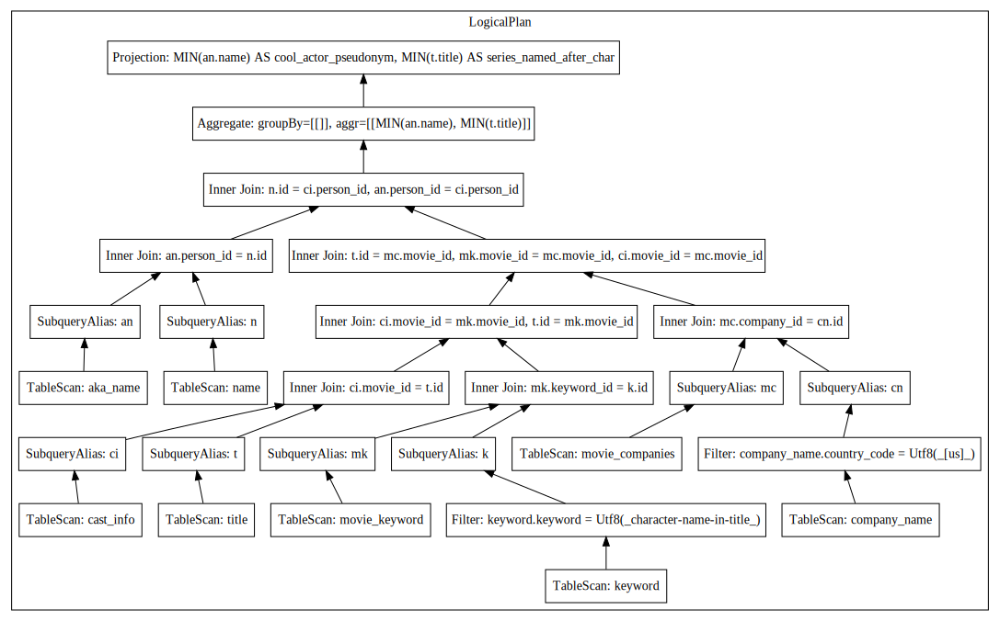

# Query Optimizer
- limited query optimizer that does Join reordering and filter push down
- Takes unoptimized datafusion logical plan (of a query from Join Order Benchmark) and outputs an optimized logical plan to be executed by datafusion.
  - uses DPCCP for join re-ordering (https://www.vldb.org/conf/2006/p930-moerkotte.pdf)

## Input and Output plans (Query 16b from JOB)
### Input:

### Output:

## Benchmark
- Running all 113 JOB queries (https://github.com/gregrahn/join-order-benchmark) on DataFusion with default configs takes around ~40 mins

- Running all 113 queries through this optimizer and then executing on Datafusion (With DF optimizer turned off) takes around ~6 mins
  - Total time (including execution and running the optimizer): ~10mins (75% faster)
    - sadly there are some queries where it takes longer to optimize them than the actual execution time :/